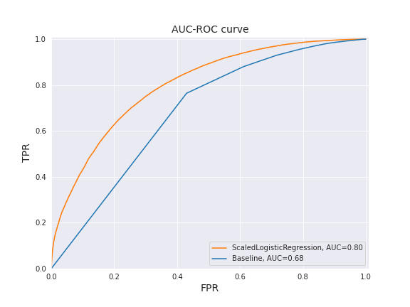
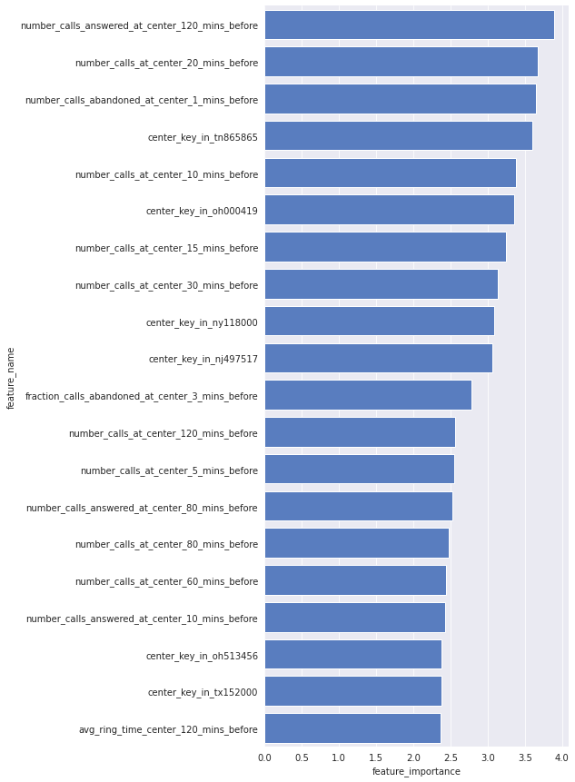
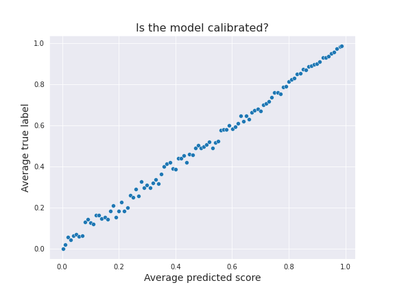
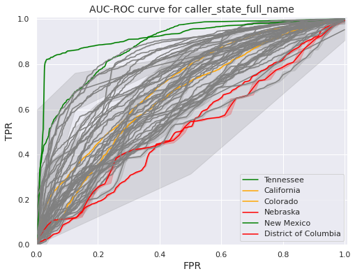

Improving the National Suicide Prevention Lifeline’s service through efficient call routing
======

This is the code repository for the project **Improving the National Suicide Prevention Lifeline’s service through efficient call routing** which was initiated during the Data Science for Social Good Felllowship from 2022. This project is developed with the collaboration of Vibrant Emotional Health.

# Table of contents
1. [Introduction](#introduction)
2. [Requirements](#requirements)
    * [Ubuntu users](#ubuntu-users)
    * [Creation of virtual environment](#creation-of-virtual-environment)
    * [Set the PYTHONPATH](#set-the-pythonpath)
    * [Prepare the folder architecture](#prepare-the-folder-architecture)
    * [Process data](#process-data)
    * [Activating development mode](#activating-development-mode)
    * [Prepare experiments environment](#prepare-experiments-environment)
3. [Data](#data)
4. [Pipeline](#pipeline)
    * [Code style](#code-style)
    * [Logging](#logging)
    * [Run the pipeline](#run-the-pipeline)
    * [Call-level pipeline](#call-level-pipeline)
        * [Run the call-level pipeline](#run-the-call-level-pipeline)
    * [Routing-level pipeline](#routing-level-pipeline)
        * [Run the routing-level pipeline](#run-the-routing-level-pipeline)
5. [Results](#results)
6. [Contributors](#contributors)
7. [Acknowledgements](#acknowledgements)

# Introduction
The motivation of the project is that some individuals who call the National Suicide Prevention Lifeline are left on hold for several minutes while experiencing a crisis. In some cases, during the hold time, they will abandon the call before receiving help. The Lifeline now receives around 2.4 million calls per year, and the volume has increased by about 14% in the last year. Of these calls, around 15% of calls get abandoned before being answered.

Improving the experience of callers to the National Suicide Prevention Lifeline is a core and ongoing mission of Vibrant Emotional Health, but is especially crucial with the [launch of the national 988 number](https://suicidepreventionlifeline.org/current-events/the-lifeline-and-988/) on July 16, 2022 for crisis support--including more visibility for the system, as well as some additional funding that will be distributed.

The goals of the project are four:
* maximize the fraction of calls to the National Suicide Prevention Lifeline that reach a counselor,
* minimize the wait time of calls to the National Suicide Prevention Lifeline,
* improve the experience of callers to the lifeline through local connections, and
* equalize call outcomes across callers’ demographics.


# Requirements
To use the `vibrant_routing` repository, you need:

- Python 3.8.10
- A PostgreSQL 9.6+ database with the source data (routing attempts, routing logic, etc.) loaded.
- Ample space on an available disk, or for example in Amazon Web Services's S3, to store the needed matrices and models for the executed experiments.
- The requirements listed in [requirements.txt](requirements.txt)

## Ubuntu users
Ubuntu users may need to run the following lines of code before creating the virtual environment because of potential unmet system dependencies:
```
$ sudo apt-get update
$ pyenv install 3.8.10
$ sudo apt-get install make build-essential libssl-dev zlib1g-dev libbz2-dev libreadline-dev libsqlite3-dev wget curl llvm libncursesw5-dev xz-utils tk-dev libxml2-dev libxmlsec1-dev libffi-dev liblzma-dev
$ pyenv install 3.8.10
```

## Create a virtual environment
We recommend starting with a new python virtual environment.

```bash
$ virtualenv vibrant-routing
$ .source ./vibrant-routing/bin/activate
```

Now, after activating the new virtual environment, the terminal should look like the following:
```
(vibrant-routing) $
```

## Create your $USER folder
Within the PARENT_FOLDER, create a folder that is the same name as your username on this server.

For instance, if your username is `usern`, then create your user folder as follows:

```
$ mkdir usern
```

## Clone the repo
Change directory to be inside your $USER folder, and then clone the repo.

```
$ cd usern
$ git clone git@github.com:dssg/vibrant_routing.git
```

## Install the requirements
Next, from within your $USER folder, change directory to be inside the vibrant-routing repo, and then install the requirements.

```
$ cd vibrant-routing
$ pip install -r requirements.txt
```

## Set the PYTHONPATH
In order to set the PYTHONPATH for all team members, it is recommended that you alter the `PARENT_PATH/.envrc` file to make it look like the following.

(The `PARENT_PATH` is the path to the folder that contains your user folder. The `.envrc` in the parent path was recommended because this way, the PYTHONPATH is altered adequately for all team members, thus reducing the need to alter it individually for each team member.)

```
# BEGIN ANSIBLE MANAGED BLOCK
PARENT_PATH=path_of_parent_folder
export VIRTUAL_ENV="PARENT_PATH/.venv"
export VIRTUAL_ENV_NAME="vibrant-routing"
PATH_add "PARENT_PATH/.venv/bin"

source_up
export PYTHONPATH="PARENT_PATH/$USER/vibrant_routing"
# END ANSIBLE MANAGED BLOCK
```

## Prepare the folder architecture

### Create folder architecture
To prepare the folder architecture for storing logs, matrices, models, and plots, execute the following line of code.

(By default, the `PARENT_PATH` is set to your current working directory (i.e. the output of `pwd`). However, when you execute this line of code, you will be given an opportunity overwrite this setting and set `PARENT_PATH` to another folder. Note that it will require some user input (y/n) to confirm whether you want to do this.)
```
. src/utils/generate_architecture.sh
```

### Clear disk

Do not run this next script now, but in the future, if you want to clean up these folders (such as if they become too cluttered), you can use this line of code. Note that it will require some user input (y/n) to confirm that you want to do this.
```
. src/utils/clear_disk.sh
```

## Process data 
In order to process the raw data, it is necessary to have the files of interest in the server and indicate their locations and properties in `PARENT_PATH/config/data_to_database_config.yaml`. As of today, 4 files in csv format are expected: (1) routing table, (2) center calls, (3) area codes by city state, and (4) basic state data. Once these files are properly defined in the aforementioned yaml file, you will need to execute the next line of code to prepare the processed data:
```
. src/prep/data/run.sh
```
This executes the steps required to process data sequentially:
- Create `raw` schema and load data into database.
- Create routing id mapping table in `raw` schema.
- Create `processed` schema and data tables.
- Create `pre_computed_features` schema and `pre_computed` data table. (Note that running this part will take ~6 hours depending on your machine. During the DSSG-Vibrant meeting on 8/18/22, it was discovered that data exists such that creating pre_computed_features would no longer be necessary, but further implementation is needed to address this. See the Technical Report for details about this.)

##  Optional: activating development mode
You want to activate development mode if you are testing code.
The development mode was created for the purposes of testing new code during the development phase because this approach 1) reduces the runtime of the pipeline; and 2) preserves the functional components of the normal environment in the case that the development code is buggy.

To run the project in development mode, run the following on the command-line:
```
export PROJECT_ENVIRONMENT="development"
```
This will switch the project constants in `config/project_constants.py` to development constants. In addition, you must ensure that you're using the development config yaml files---these are the ones that begin with `dev_`.

For example, the `config/dev_modeling_config.yaml` mirrors `modeling_config.yaml`, but it runs the pipeline with fewer configurations for ease of testing.

## Prepare experiments environment
To prepare the experiments environment, you will need to execute the next line of code:
```
. src/prep/experiment/run.sh
```
This executes the steps required to create the experiments environment sequentially:
- Create `experiments` schema and the necessary data tables inside that schema. If `development` mode is activated, this will create a `dev_experiments` schema instead.

# Data
The data has been processed to only take into consideration those calls whose registers are entirely in the database. In other words, only the calls that have been terminated in Vibrant's network are taken into account.

# Pipeline
## Code style
All the code written aims at complying with the style guide for Python code [PEP8](https://pep8.org/). To guarantee its compliance, we recommend the usage of [Black](https://pypi.org/project/black/) to reformat entire files.

## Logging
Logging is automatically performed in the execution of the pipeline. The logging configuration is set in `src/utils/logging_util.py`. 
<div class="alert alert-warning">
    <b>Disclaimer!</b> The configuration file that generated an experiment is stored in the log file, and the path to each log file is stored in the database. It is important not to delete the log file in question if you want to trace the exact yaml file that generated the experiment, because the log file is the only place where the yaml file configuration for an experiment is stored.
</div>

# Run the pipeline
The configuration file needed to run the pipeline can be found in [`config/modeling_config.yaml`](https://github.com/dssg/vibrant_routing/blob/main/config/modeling_config.yaml). The pipeline can be ran independently for the call-level and for the routing-level. To do so, we use a list of optional parameters to set the desired configuration. The next line of code shows an example of how to run the routing-level pipeline:

```
python src/main.py --config config/modeling_config.yaml --run_call_level_pipeline False --run_routing_level_pipeline True
```

## Call-level pipeline
### Run the call-level pipeline
The configuration file needed to run the call-level pipeline can be found in [`config/modeling_config.yaml`](https://github.com/dssg/vibrant_routing/blob/main/config/modeling_config.yaml). After the desired parameters are inputted into the config file, the following line of code should be executed to run the call-level pipeline:

```
python src/main.py --config config/modeling_config.yaml --run_call_level_pipeline True
```

There are other optional input parameters that configure how to run the pipeline. Those are:

* `--create_cohort`: indicate whether the cohort table should be created,
* `--create_label`: indicate whether the label table should be created,
* `--create_features`: indicate whether the features table should be created, and
* `--create_plots`: indicate whether the plots should be created.

## Routing-level pipeline
Information about the logic underlying the routing-level pipeline may be found in [/docs/PIPELINE.md](https://github.com/dssg/vibrant_routing/blob/main/src/PIPELINE.md).

### Run the routing-level pipeline
The configuration file needed to run the routing-level pipeline can be found in [`config/modeling_config.yaml`](https://github.com/dssg/vibrant_routing/blob/main/config/modeling_config.yaml). After the desired parameters are inputted into the config file, the following line of code should be executed to run the routing-level pipeline:

```
python src/main.py --config config/modeling_config.yaml --run_routing_level_pipeline True
```

# Results
The prediction task for the call-level consisted of predicting the likelihood of a call being answered at a specific call center at a given time. This model should provide adequate predictions to all available call centers at all possible times since it should be able to evaluate the performance of all possible routing tables. In other words, the call-level model should be able to adequately predict the likelihood of calls being answered since this would be the basis to simulate the dynamics of a set of incoming calls from any available exchange code.

The best model had an AUC-ROC of 0.80 while the best baseline had an AUC-ROC of 0.68. This means that the best ML model shows an improvement of 17.64% over the best baseline.

<p align="center">
 
</p>

The best model is a Logistic Regression characterized by the following set of parameters

| Parameter    | Value     | Parameter    | Value     | Parameter         | Value     |
|--------------|-----------|--------------|-----------|-------------------|-----------|
| C            | 1         | penalty      | l2        | multi_class       | auto      |
| tol          | 0.0001    | verbose      | 0         | class_weight      | null      |
| dual         | FALSE     | l1_ratio     | null      | random_state      | null      |
| n_jobs       | -8        | max_iter     | 100       | fit_intercept     | TRUE      |
| solver       | saga      | warm_start   | FALSE     | intercept_scaling | 1         |

It is also important to understand which are the features that enable the model to make predictions. In the following figure, we observe the feature importance for the 20 most important features. The importance of features is derived from the absolute value of the model coefficients. The larger the importance of a feature, the more weight that feature has in the prediction task. The most influential feature to predict whether a call will be answered at time Y at call center X represents the number of calls answered at call center X in the 2 previous hours to time Y.

Note that the coefficient values do not have a meaning by themselves; they just characterize the relative weight of the features when comparing them to the rest.

<p align="center">
 
</p>

Knowing which features are most important is not enough to understand how a model behaves. To understand that better it is relevant to analyze how the values of the best model change based on the predicted score. This is shown in the following table, also referred to as crosstabs.

The following table shows the crosstabs for some of the variables. In the table we compare its average in the population with scores lower and larger than 0.5. This score has been chosen because of its ease of interpretation. The threshold of 0.5 seems to be the threshold that better partitions the negative and positive classes. There are 20,989 routing attempts characterized with score < 0.5 and 123,343 routing attempts with score ≥ 0.5.

A number of variance-related features present a high difference in ratio, probably because the magnitude of variance-related features is bigger than the rest. Because of that, only a few are shown in the table. Other variables that also show a high ratio difference are the maximum time to abandon a call center 3 minutes before, which is larger for calls with a score < 0.5 than for the rest. This is analogous to other types of variables that characterize time to abandon a call center or the ring time of a call center.

| Feature                                            | Score < 50% | Score >= 50% | Max ratio | Absolute difference |
|----------------------------------------------------|-------------|--------------|-----------|---------------------|
| variance_ring_time_center_1_mins_before            | 23.55       | 1.15         | 20.51     | 22.40               |
| number_calls_flowout_from_center_100_mins_before   | 3.83        | 0.45         | 8-47      | 3.38                |
| max_time_to_abandon_center_3_mins_before           | 6.54        | 1.10         | 5.98      | 5.45                |
| avg_time_to_abandon_center_5_mins_before           | 7.46        | 1.27         | 5.86      | 6.18                |
| avg_ring_time_center_1_mins_before                 | 10.67       | 1.85         | 5.79      | 8.83                |
| avg_time_to_abandon_center_10_mins_before          | 9.84        | 1.79         | 5.51      | 8.05                |
| avg_time_to_abandon_center_120_mins_before         | 13.17       | 3.88         | 3.40      | 9.30                |
| min_ring_time_center_30_mins_before                | 47.39       | 14.67        | 3.23      | 32.72               |
| number_calls_answered_at_center_60_mins_before     | 1.39        | 3.21         | 2.31      | 1.82                |
| number_calls_answered_at_center_120_mins_before    | 2.71        | 6.13         | 2.26      | 3.42                |
| avg_time_to_answer_center_100_mins_before          | 7.61        | 13.93        | 1.83      | 6.32                |
| number_calls_at_center_15_mins_before              | 1.63        | 1.07         | 1.52      | 0.56                |
| stddev_time_to_answer_center_60_mins_before        | 10.09       | 6.79         | 1.49      | 3.30                |
| number_calls_at_center_20_mins_before              | 2.07        | 1.40         | 1.48      | 0.67                |
| num_nspl_centers_in_center_state                   | 6.36        | 8.25         | 1.30      | 1.89                |
| number_calls_at_center_100_mins_before             | 8.02        | 6.23         | 1.29      | 1.80                |

The ambition of this project is to use the best model from the call-level pipeline to predict the probability of a call being picked up at a given time at a particular call center. To be able to do that, it is important that the model is properly calibrated so that scores can be interpreted as probabilities.

An adequate calibration implies that the predicted scores positively correlate with the actual labels. One way of validating this hypothesis is to compare the average predicted scores vs. the average true labels and look at its correlation.

The next figure depicts the comparison of the average of those two metrics rounding to the hundredth. As it can be observed from the next chart, the current best model is properly calibrated since the predicted scores highly correlate with the true labels.

<p align="center">
  
</p>

In the next chart, we display the differences in AUC-ROC per state. The states that have the lowest AUC-ROC are:

1. Nebraska (884 routing attempts, AUC-ROC of 0.52), 
2. District of Columbia (562 routing attempts, AUC-ROC of 0.52), 
3. Hawaii (696 routing attempts, AUC-ROC of 0.53), 
4. South Dakota (293 routing attempts, AUC-ROC of 0.56), 
5. Louisiana (1,525 routing attempts, AUC-ROC of 0.57),
6. West Virginia (776 routing attempts, AUC-ROC of 0.58),
7. North Carolina (4,998 routing attempts, AUC-ROC of 0.58), and
8. Connecticut (1,283 routing attempts, AUC-ROC of 0.59).

<p align="center">
  
</p>

# Contributors
Those listed below have contributed directly to the implementation of this project (lastname alphabetical order):

* Tejumade Afonja
* Charles Cui
* Paula Subías-Beltrán
* Irene Tang

Those listed below have contributed to the project (alphabetical order):

* Kasun Amarasinghe as data science support
* Kit Rodolfa as technical mentor
* Adolfo De Unánue as data science support

# Acknowledgements
This work was conducted in the [Data Science for Social Good Fellowship](https://www.dssgfellowship.org/) at [Carnegie Mellon University](https://www.cmu.edu/) with the support from [Vibrant Emotional Health](https://www.vibrant.org/).

From our partners at Vibrant, we especially want to acknowledge the contribution of:
* Rebecca Rosen
* Sean Murphy
* Jody DeMilia