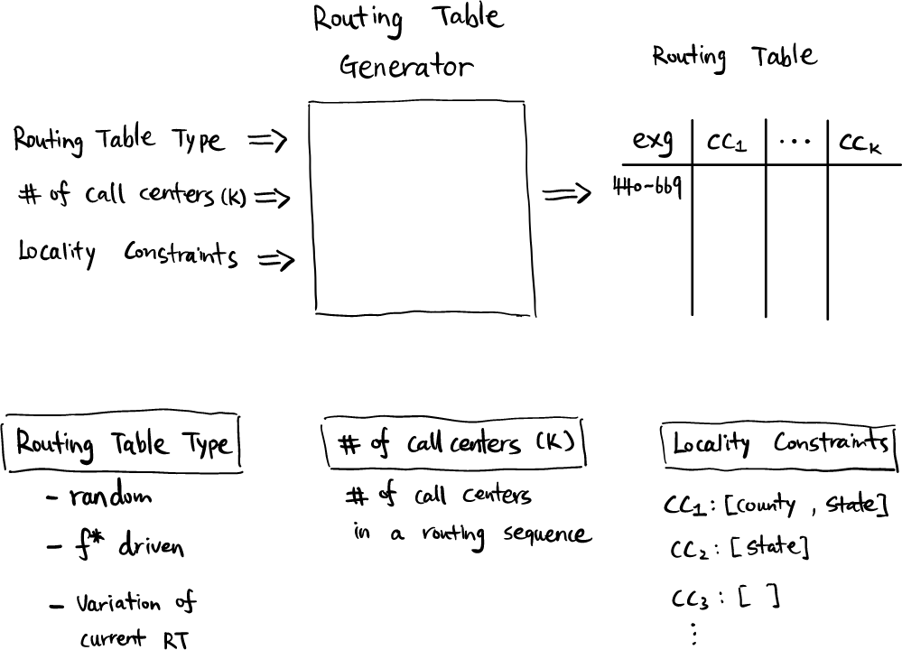

Simulator
=======

## Workflow
---

This file contains all the logic that characterizes the underlying logic of the routing simulator.

The following image depicts the overall flow.


## Call-level pipeline


## Routing-level pipeline

### Simulated call data
The function `cohort_creator` coded in `src/pipeline/routing/cohort_creator.py` sets up the routing level schema and cohort tables. This function takes as input:
- `db_conn` (object) -- database connection.
- `config` (dict) -- dictionary with <routing_level> configuration.
- `split_datetime` (dict) -- dictionary with time splits to create the
                                 active call queue and historical datasets.

To create the simulated data, we need to specify the date to begin the simulation. This information called `simulation_start_datetime` is captured in the modeling config files (see `config/modeling_config.yaml`) under the `routing_level_config["temporal_config"]` dictionary. Given the `temporal_config`, we can generate the datetime for the historical data, i.e., data before the simulation date and the datetime for the active (or future) calls, i.e., the data to be simulated. The function that does this is implemented in `src/pipeline/routing/split_data.py` (It's functionality is similar to the call_level split data function: see `src/pipeline/call/split_data.py`) and the main function is called `split_data`. This function takes as input:

- `temporal_config` (dict) -- dictionary with parameters to perform the temporal configuration.
- `output_filename` (str, optional) -- file name for the json file that contains the time splits.
                                            Defaults to NoneType.

See an example of the function output:
```
{
    "historical": {
        "start_datetime_est": "2021-12-01 00:00:00",
        "end_datetime_est": "2022-05-25 23:59:59.999999"
    },
    "simulation": {
        "start_datetime_est": "2022-05-26 00:00:00",
        "end_datetime_est": "2022-05-27 00:00:00"
    }
}
```

The `cohort_creator` uses these splits to create three different tables in the `routing_level` schema: namely, the `historical_routing_attempts`, `simulated_routing_attempts` and `active_calls_in_queue`. The `simulated_routing_attempts` cohort table will be initially empty but later on, it will be updated by the routing simulator using the active calls that are currently in queue.

The `PopulateSimulatedData` class populates the simulated data in the database and it is implemented in `src/pipeline/routing/populate_simulation_table.py`. It inherits the `ModifyDBTable` class from `src/utils/sql_util.py`. The two main methods for this class that are useful for the routing level pipeline are: 1) the `insert_data_into_table`, which inserts given data in the database; and 2) `update_row_in_table`, which updates a row in the database using a unique identifier.


### Routing table generator


### Routing simulator
The routing simulator simulates the routing of the set of calls of interest. The underlying logic of the routing simulator is depicted in the next image.


The routing simulator is coded in `src/pipeline/routing/simulator.py` and the main function is called `simulate_routing()`. This function takes as input:

* `db_conn` (object) -- database connection.
* `model` (object) -- model used to predict whether a call will be picked up or not a given call center.
* `routing_table_path` (str) -- path where to find the routing table of interest.
* `config_routing_level` (dict) -- dictionary with the elements that characterise the routing level configuration.

The queue of calls is managed by the package [`heapq`](https://docs.python.org/3/library/heapq.html), which allows us to implement a priority queue based on the datetime at which the calls are supposed to arrive at each center. Each call is processed in the same manner:

1. As long as there are calls in the queue, we take the next call. In this context, taking the next call means that we process the unserved call that happens the earliest in time. To be precise, we will serve that call but we will be looking at the particular information of the corresponding routing attempt.
2. We check to which call center that call should be routed to based on its routing attempt. In case that the call comes from an unknown exchange number, the call will not be routed through the local network.
3. We will compute the probability from the selected call center to pick up that call at the given time through the optimal model found in the call-level pipeline. To accomplish this, we need to compute the features that characterise that call and that center at the given time.
    * The computation of the features is needed to be performed independently due to the time dependencies among the different calls in the queue of active calls.
4. Based on a biased coin, we will decide the future of the call.
    1. If the call is picked up, the call doesn't return to the queue.
    2. If the call is not picked up, it may be abandoned or not. Based on a simple model, we calculate the probability of abandonment based on the waiting time. And, again, based on a biased coin we will decide whether the call is abandoned or not.
    3. If the call is not picked up nor abandoned, the call will re-enter the queue with an increased time of X minutes, where X comes from a simple model that returns 3 minutes if a center has an ACD system or 1 minute if the center has not an ACD system.

During all the process, the history of the calls is logged in a `routing_attempts` table that replicates the original `routing_attempts` table.